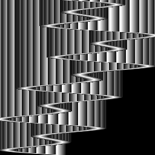
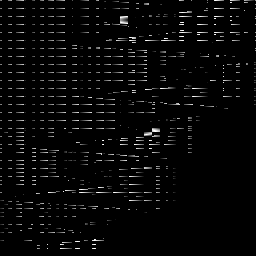

# Pillars bad image

## Shader Html of Wrong Image:

simpler-version-bad-pillars-31-july.html

Untransformed shader is: https://github.com/mc-imperial/wgsl-fuzz/blob/main/samples/pillars.wgsl

## System specification

- APU: AMD Radeon (TM) Graphics VRAM 512 MB DDR4 1333 MHz
- Bios Version 017.010.000.031
- Bios Date: 2022/02/23 06:22
- Driver Version: 23.19.16.02-240814a-408529C-Asus
- AMD Windows Driver Version: 31.0.21916.2001
- Direct3D API Version: 12.1
- Vulkan API Version: 1.3.260
- OpenCL Api Version: 2.0
- OpenGL Api Version: 4.6
- Direct3D DriverVersion: 9.14.10.01526
- Vulkan Driver Version: 2.0.279
- OpenCL Driver Version: 31.0.21916.2001
- OpenGL Driver Version: 24.08.230729_569461f
- 2D Driver Version: 8.1.1.1634
- Windows Edition: Windows 11 Core (64 bit)
- Windows Version: 24H2
- CPU: AMD Ryzen 7 5725U with Radeon Graphics
- RAM: 16 GB

## Desired Image:

## Wrong Image Output:

When repeat rendering of the shader the image is slightly different but looks similar to the above.
